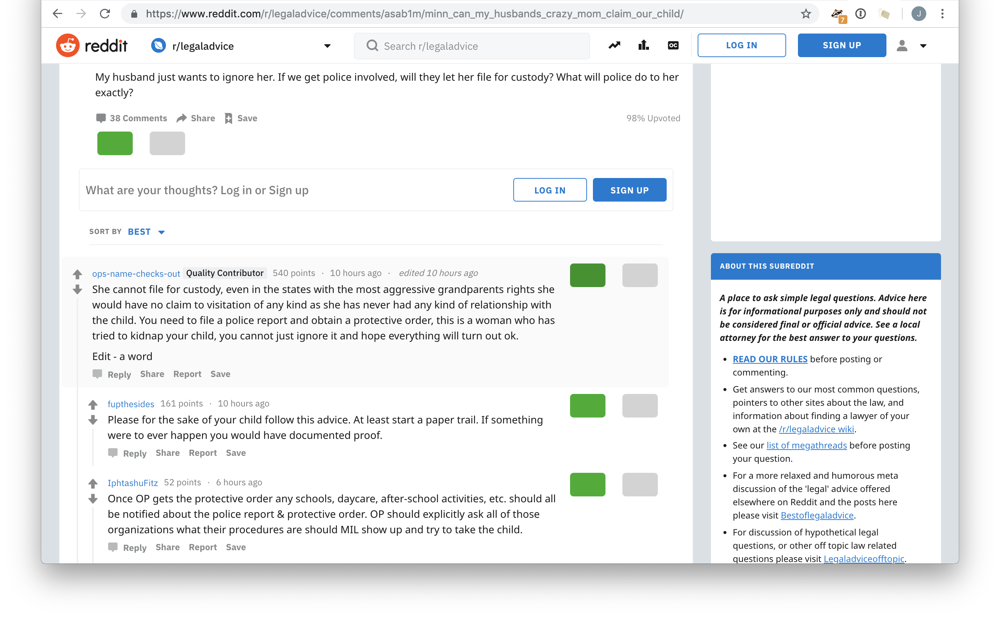
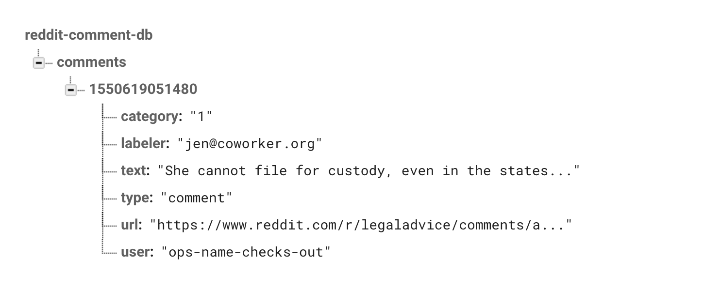

## What is this?
This is a Chrome extension we built at Coworker.org to create a labeled dataset for a wage theft classifier.

It injects a simple, two-button interface on top of Reddit comments that, when clicked, sends data about the comments to our Firebase database.

See [docs/](docs/) for instructions on setting up your own API keys and Firebase credentials.

### Interface

### Database

## Thanks
- [Creating a Chrome extension in 2018: The good, the bad and the meh](https://checklyhq.com/blog/2018/08/creating-a-chrome-extension-in-2018-the-good-the-bad-and-the-meh/)
- [Firebase Auth Chrome extension quickstart](https://github.com/firebase/quickstart-js/tree/master/auth/chromextension)
