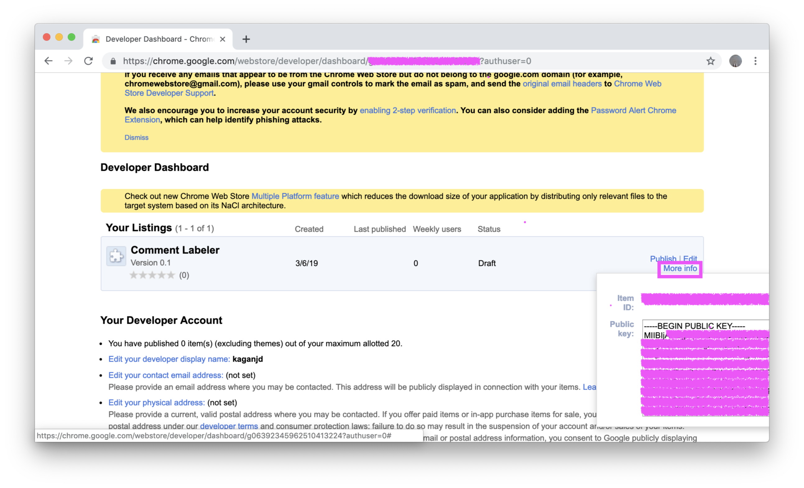

Credit: Lots of the instructions that follow are from  [https://github.com/firebase/quickstart-js/tree/master/auth/chromextension](https://github.com/firebase/quickstart-js/tree/master/auth/chromextension). I've mostly just added one thousand screenshots!

# Get a Chrome app ID and public key
1. Once you've edited the config and manifest, compress the folder. Google requires that you upload the extension as a .zip file.
3. Go to your [Chrome App Developer Dashboard](https://chrome.google.com/webstore/developer/dashboard?authuser=0)
4. Click "Add new item"
5. If the upload goes smoothly, this should take you to a screen where you upload product photos, select regions where the extension should be available, etc. You can ignore all of this at this point. Just scroll to the bottom and click "Save draft and return to dashboard".
6. You should see the extension under "Your listings". On the right side, click "More info" to get your Chrome item ID and public key. You'll need these and some other IDs at various points later. I copy/paste to Stickies on Mac OS X to keep everything organized.

7. In `manifest.json`, add a comma after the curly bracket on line 33 and add the key you just created. This section of the manifest will go from
```
  "oauth2": {
    "client_id": "",
    "scopes": [
      "https://www.googleapis.com/auth/userinfo.email",
      "https://www.googleapis.com/auth/userinfo.profile"
    ]
  }
}
```
to
```
  "oauth2": {
    "client_id": "",
    "scopes": [
      "https://www.googleapis.com/auth/userinfo.email",
      "https://www.googleapis.com/auth/userinfo.profile"
    ]
  },
  "key": "MIIB..."
}
```
# Next
[Set up OAuth for the Chrome extension](2-oauth.md)
