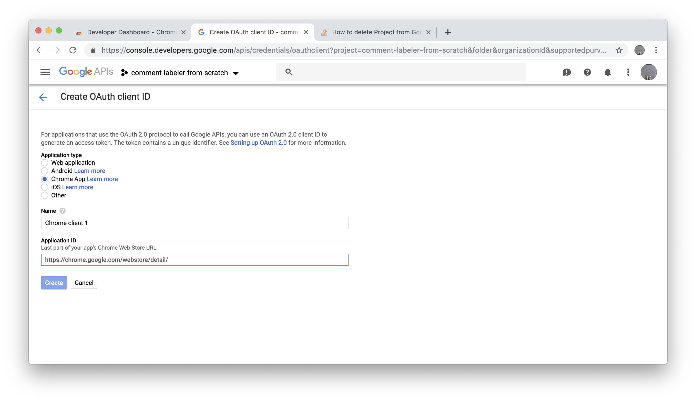

# Set up OAuth for the Chrome extension
1. Go to your [Google Developer Console](https://console.developers.google.com/apis/credentials/oauthclient?project=_&pli=1)
2. Click "Create"

2. Name the project.

3. If everything is grayed out, you will have to "Configure consent screen".

3. You just need to fill out the "Application name" field and continue.

3. This should take you back to the "Create OAuth Client ID" screen. For application type, select "Chrome app" and, for application ID, enter your Chrome item ID from the previous section. Click "Create".

5. The next screen should show you the OAuth client ID.

5. Add it to `manifest.json` under the OAuth2 section. After this step, this section of the manifest should read:
```
  "oauth2": {
    "client_id": "...apps.googleusercontent.com",
    "scopes": [
      "https://www.googleapis.com/auth/userinfo.email",
      "https://www.googleapis.com/auth/userinfo.profile"
    ]
  },
  "key": "MIIB..."
}
```

#### Disable billing
9. The last thing to do in this section is disable billing, which will make configuring Firebase a little easier. Click the hamburger menu on the left side of the page and go to **Billing** > **Overview**.

9. Click the three vertically stacked dots to the right of the project name and then "Disable billing"

9. No need to click anything when you get to "This project has no billing account".

# Next
[Set up a Firebase project](3-firebase-setup.md)
