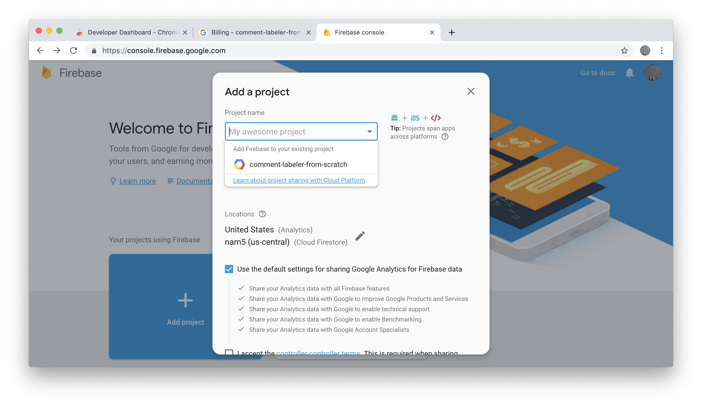
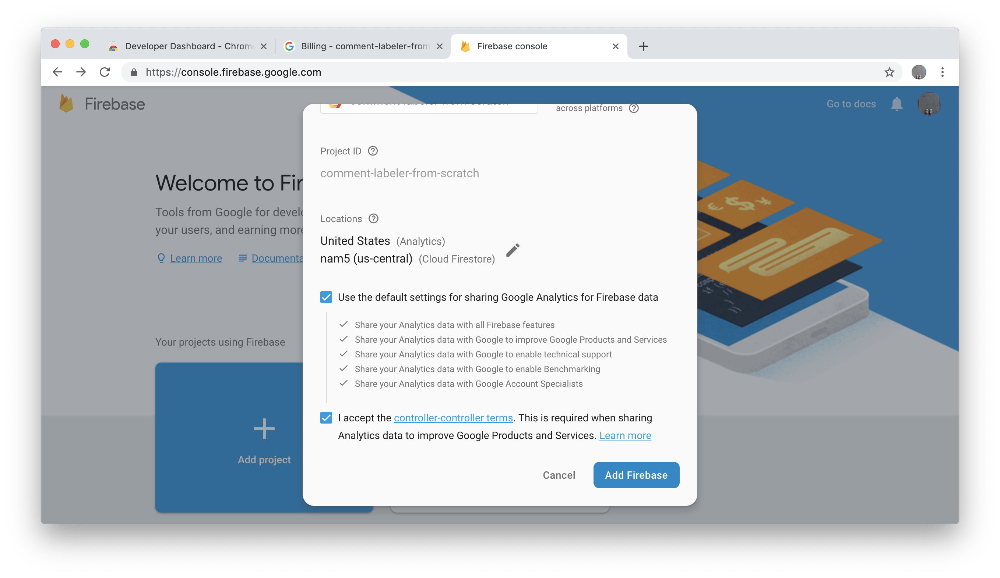
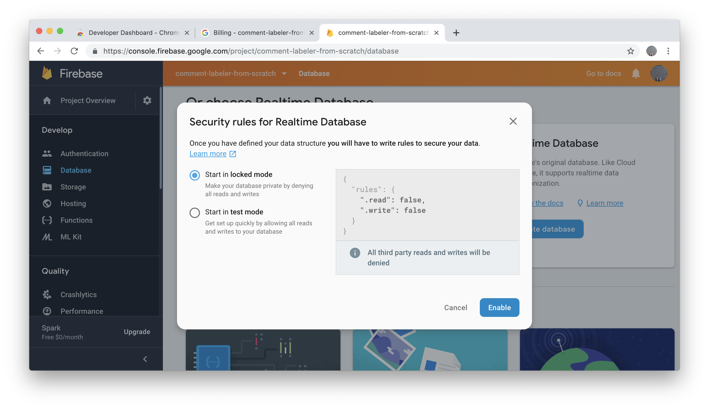
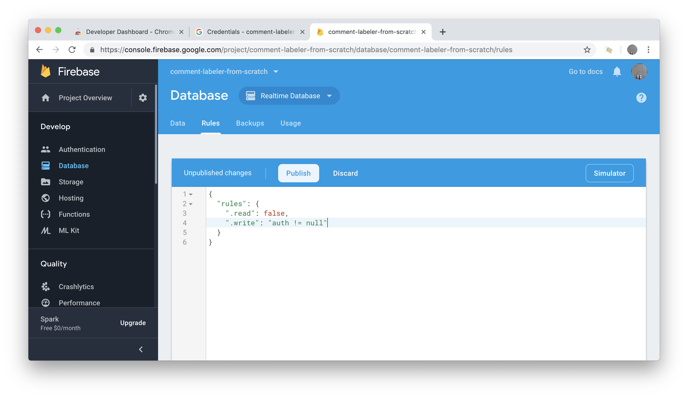
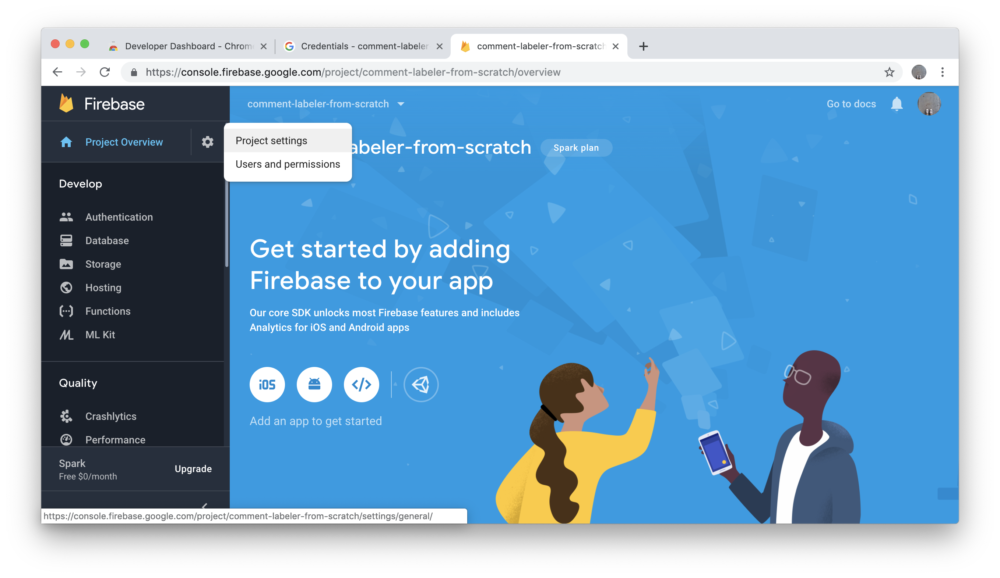
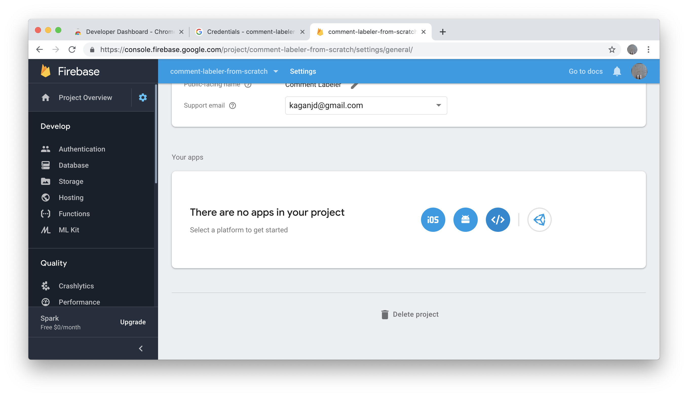
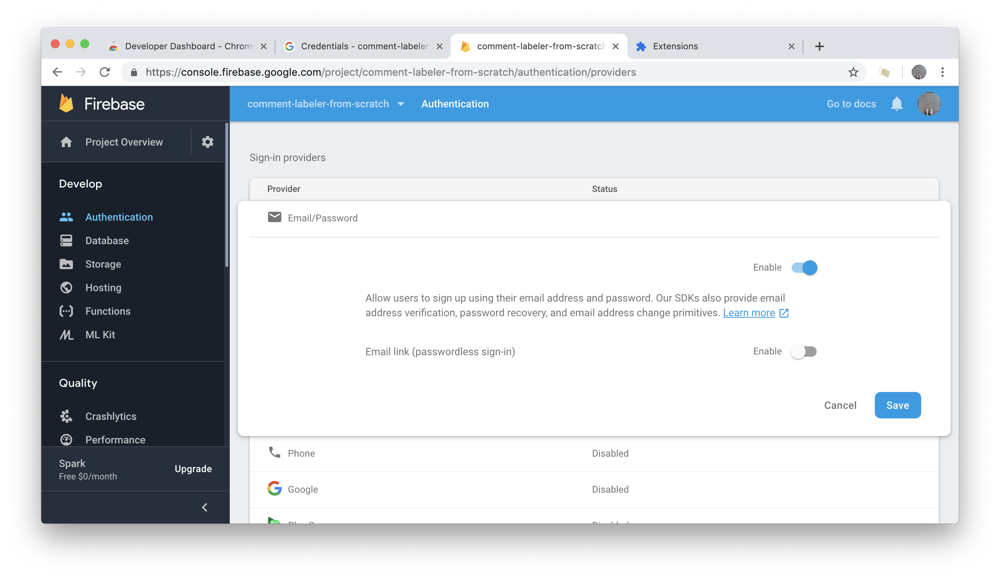

# Set up a Firebase project
1. Go to the [Firebase console ](https://console.firebase.google.com/)
2. Click the big blue "Add project" and then the dropdown to add Firebase to the existing Google Cloud project you created in the last section.

3. Check all the boxes to give away your privacy and then "Add Firebase"

#### Set up Realtime Database and add a web app
4. From the main menu, go to **Database** and then choose Realtime Database

5. For security rules, select "Start in locked mode" and then click "Enable".

5. This should take you to your new database. Go to the **Rules** section. Update `".write": false` to `".write": "auth != null"` and hit "Publish" to save the rule change.

6. From the main menu, click the gear next to **Project Overview** and then **Project settings**.

6. Under **Your apps**, click `</>` to add a web app.

7. Add these credentials to your `config.js` file.
#### Authentication
8. Last thing! From the main menu, choose the sign-in provider you'd like to enable. The Comment Labeler extension is set up to use **Email/Password**.

# Next
[Load the unpacked extension to test it](4-load-unpacked.md)
