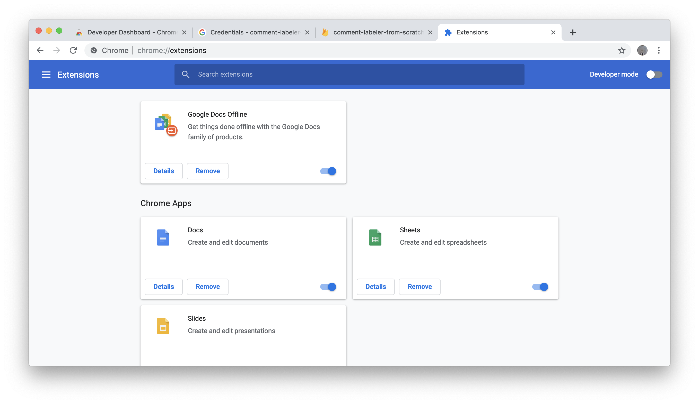
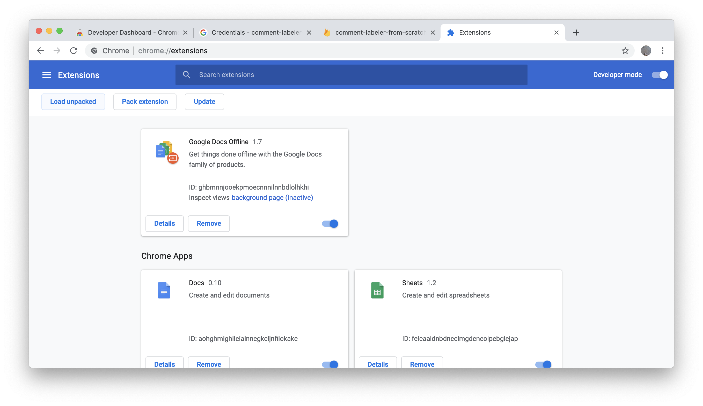
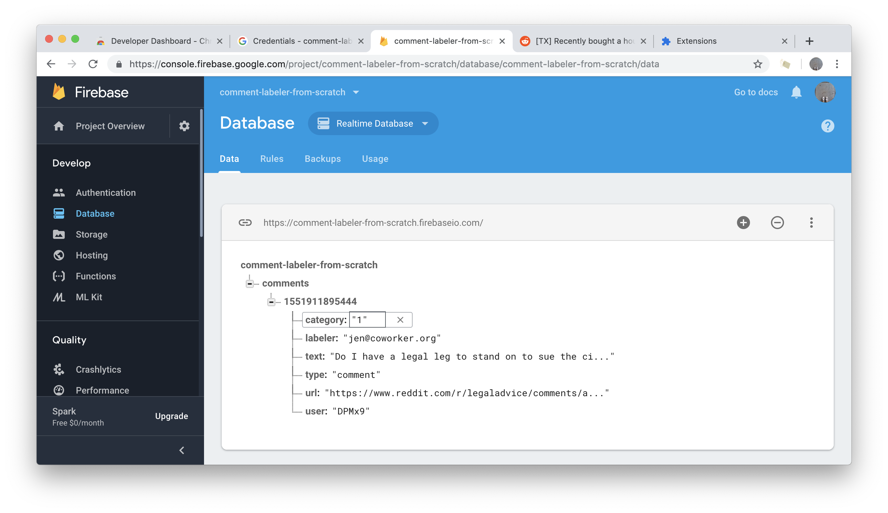

# Load the unpacked extension to test it
1. Go to [chrome://extensions](chrome://extensions)
2. Toggle "Developer mode" in the top right corner.

3. Click "Load unpacked" and select the parent directory extension on your desktop. No need to compress it to a .zip file at this point.

3. Click the extension icon in your browser bar and log in. Navigate to a URL where the extension should work (ex: [https://www.reddit.com/r/legaladvice/comments/axawxf/broke_policy_at_work_to_not_discuss_my_salary_can/](https://www.reddit.com/r/legaladvice/comments/axawxf/broke_policy_at_work_to_not_discuss_my_salary_can/)).
4. Click the injected buttons and then check your load-unpacked database to make sure data was sent and stored.

5. If everything looks good, you're ready to publish.
# Next
[Publish](5-publish.md)
