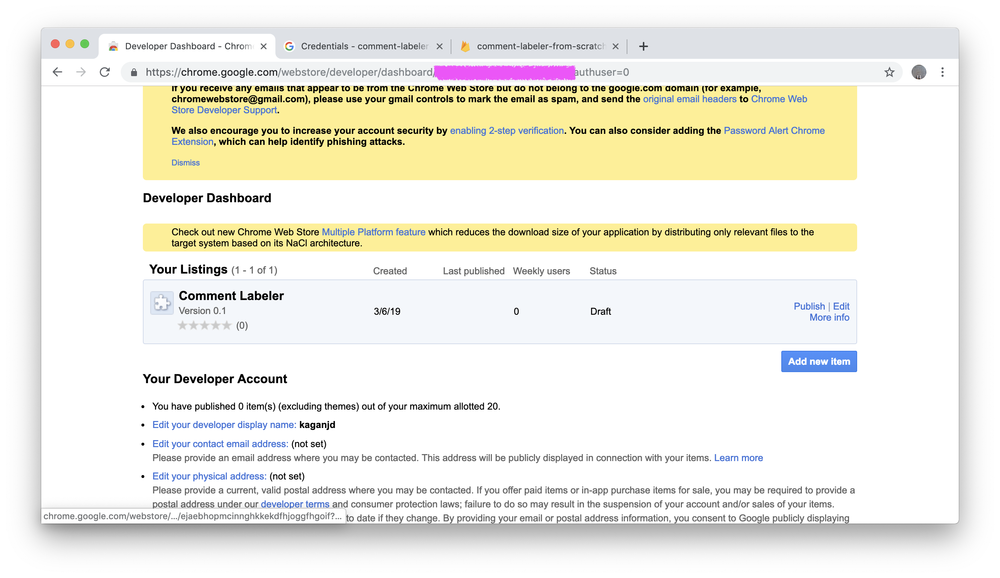
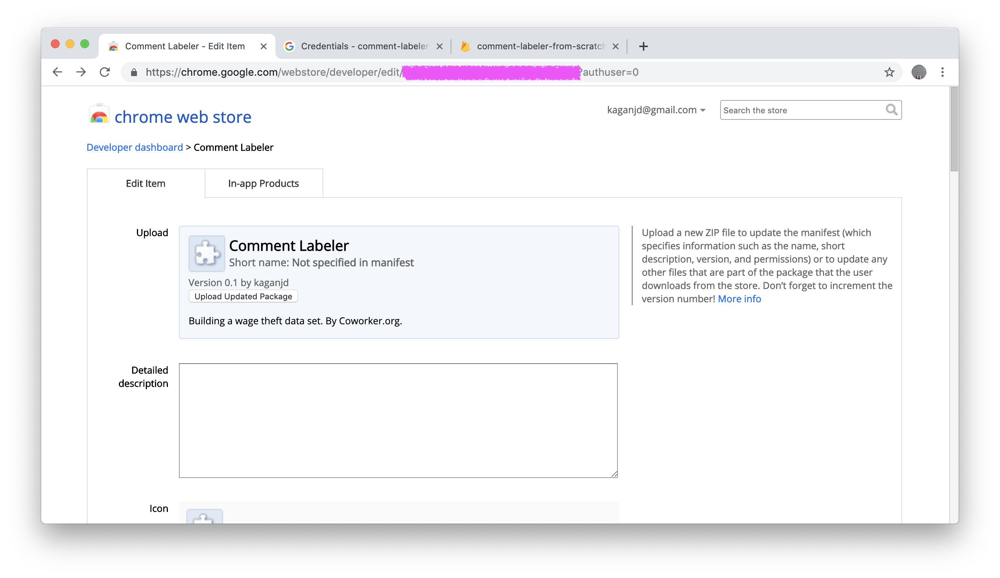
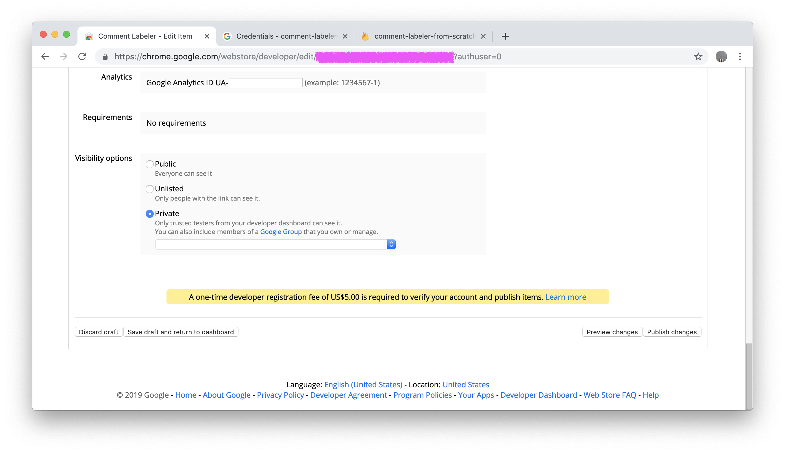
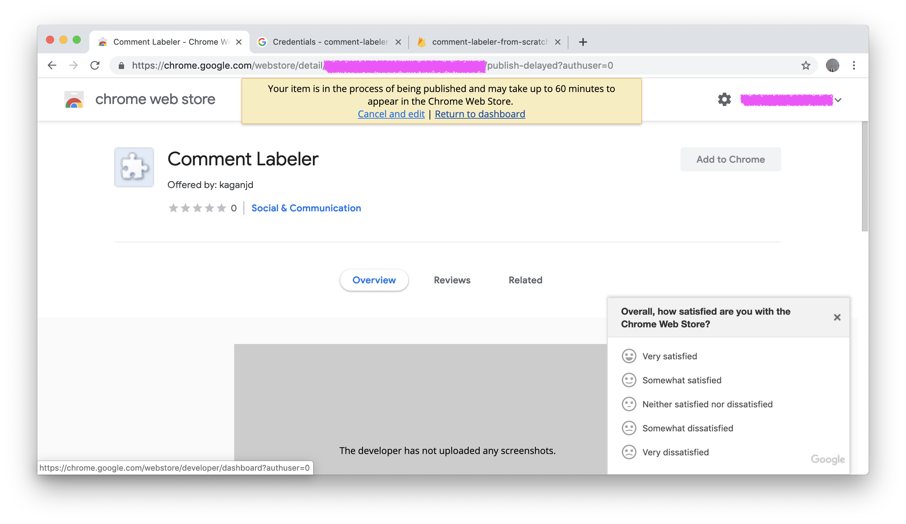

# Publish
1. Delete the compressed extension you used at the beginning to get a Chrome item ID and public key.
1. Create a new compressed file with the updated `manifest.json` and `config.js`.
1. Go to your [Chrome App Developer Dashboard](https://chrome.google.com/webstore/developer/dashboard?authuser=0)
2. Click "Edit" on the right side

2. Click "Upload Updated Package" and add the new compressed file.

3. Enter a description, primary category, and language.
4. At the bottom of the page, decide whether you want the extension to be public, unlisted, or shared with a private group of testers.

5. Click "Publish changes"

